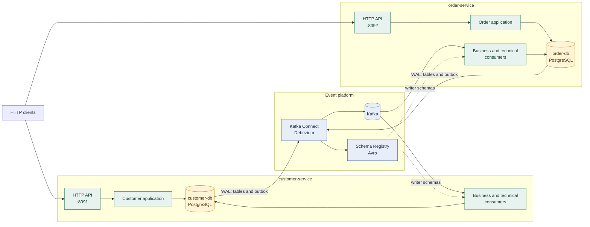
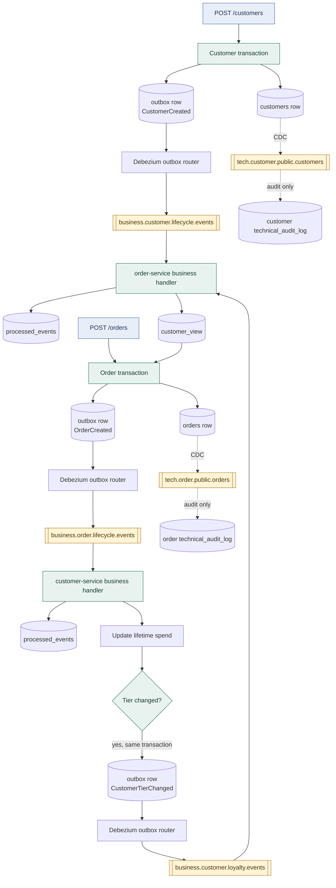
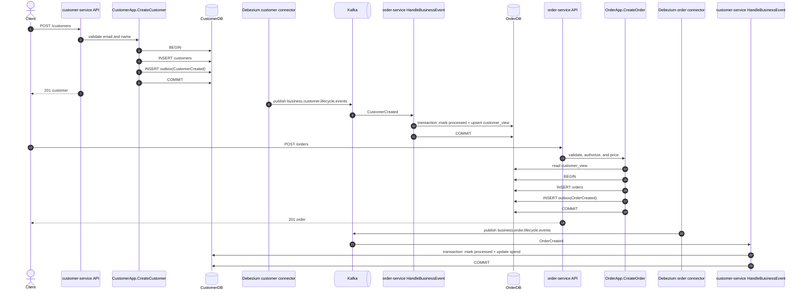
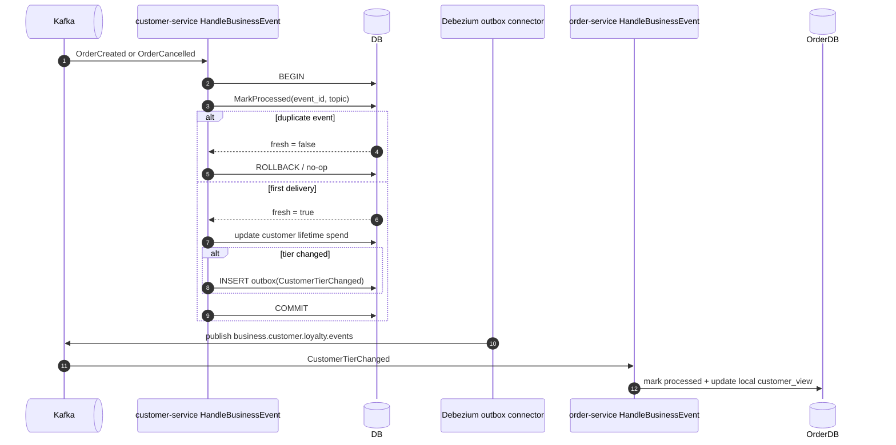
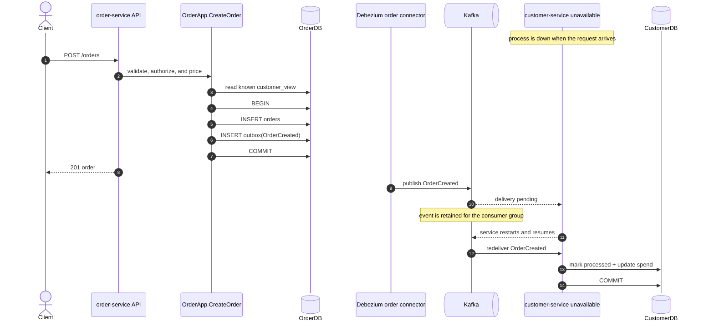
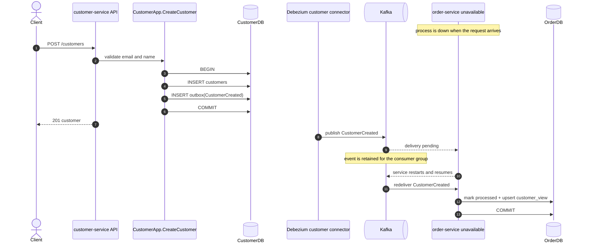

# eda_microservices

An event-driven architecture you can run on a laptop, built to make one
distinction concrete: **technical events are not business events**, and the
outbox pattern is what lets you publish both without ever lying about your
database.

Two Go services, each owning its own PostgreSQL database, exchange events
through Kafka. Neither ever calls the other over HTTP.

| Repository                                                              | Role                                        |
| ----------------------------------------------------------------------- | ------------------------------------------- |
| [customer-service](https://github.com/MagicRodri/customer-service)      | Customer accounts, tiers, blocking          |
| [order-service](https://github.com/MagicRodri/order-service)            | Orders, pricing, authorisation              |
| this repo                                                                | Infrastructure, connectors, orchestration   |

## Quick start

```bash
git clone https://github.com/MagicRodri/eda_microservices
cd eda_microservices

make bootstrap    # fetch the two service repos into services/
make up           # build and start Kafka, Schema Registry, Connect, 2x Postgres, both services
make connectors   # register the four Debezium connectors
make demo         # walk the whole event loop and assert each hop
```

Then open <http://localhost:9000> to browse topics and messages in Kafdrop.
It is wired to the Schema Registry, so selecting **AVRO** as the message format
when viewing a topic shows decoded records instead of raw bytes.

| Endpoint          | URL                     |
| ----------------- | ----------------------- |
| Kafdrop           | http://localhost:9000   |
| Schema Registry   | http://localhost:8081   |
| Kafka Connect     | http://localhost:8083   |
| customer-service  | http://localhost:8091   |
| order-service     | http://localhost:8092   |

## Visual model

### Architecture

Each service owns its database and publishes through its own outbox connector.
Kafka is the only cross-service transport: there are no synchronous HTTP calls
between the services.



### Event and request flow

The two streams share the same WAL but have different contracts. Technical
events stay inside the owning service for audit; business events cross the
service boundary and update a local projection.



### Method sequences

#### `POST /customers` and `POST /orders`

Both commands validate and persist domain state plus their business event in a
single database transaction. Kafka publication happens later from the WAL.



#### Reactive event handler and idempotency

The same transaction records the consumed event, applies its effect, and emits
the next event when a tier threshold is crossed. A redelivery exits after
`MarkProcessed` reports that the event was already handled.



### Availability scenarios

#### Order request while customer-service is unavailable

`POST /orders` does not call customer-service. If the order service already has
the customer in its local view, it can authorize and price the order while the
customer service is down. The resulting `OrderCreated` event remains in Kafka
until the customer consumer returns; the customer spend projection is delayed,
not lost.



If `customer_view` has never received `CustomerCreated`, the order request
returns `409` instead. The local projection is the availability boundary: a
known customer can be served with bounded staleness, while an unknown customer
cannot be safely authorized.

#### Customer request while order-service is unavailable

`POST /customers` has the same isolation in the other direction. The customer
row and `CustomerCreated` event commit together even when order-service cannot
consume Kafka. Once order-service returns, it builds its local view and can
accept orders for that customer.



## The two kinds of events

Both streams come out of the same Postgres WAL, through the same Kafka Connect
worker, serialised as Avro against the same registry. What differs is the
contract they carry.

### Technical events — `tech.*`

Raw change-data-capture. One Debezium connector per service publishes the full
Debezium envelope (`before`, `after`, `op`, `source`), one topic per table.

**Topic names are derived, never listed.** Each connector captures its whole
`public` schema and excludes only the service's own plumbing, so the topic for
a table follows automatically as `tech.<domain>.<schema>.<table>` — adding a
business table produces a new topic with no connector change:

```json
"schema.include.list": "public",
"table.exclude.list": "public.outbox,public.processed_events,public.technical_audit_log,public.schema_migrations"
```

A service that needs to pin the set instead replaces `schema.include.list`
with an explicit `table.include.list`, which takes precedence. On the consuming
side the same choice exists: `TECHNICAL_TOPIC_PATTERN` matches the derived
family, and setting `TECHNICAL_TOPICS` to a comma-separated list overrides it
with exactly those topics.

The shape of these events *is* the physical table. Rename a column and every
consumer breaks. They are the right tool for audit, analytics, search indexing
and replication — infrastructure concerns that legitimately want the raw row.

Each service consumes only **its own** technical topics, into a
`technical_audit_log` table. That is deliberate: it demonstrates the stream
without ever letting a business decision depend on another service's schema.

### Business events — `business.*`

Explicit, versioned domain facts. Each event names a **channel**, and the
channel becomes the topic — so a domain spreads its events over as many topics
as its consumers need:

| Event                 | Owner            | Channel            | Topic                                 |
| --------------------- | ---------------- | ------------------ | ------------------------------------- |
| `CustomerCreated`     | customer-service | `customer.lifecycle` | `business.customer.lifecycle.events` |
| `CustomerBlocked`     | customer-service | `customer.lifecycle` | `business.customer.lifecycle.events` |
| `CustomerUnblocked`   | customer-service | `customer.lifecycle` | `business.customer.lifecycle.events` |
| `CustomerTierChanged` | customer-service | `customer.loyalty`   | `business.customer.loyalty.events`   |
| `OrderCreated`        | order-service    | `order.lifecycle`    | `business.order.lifecycle.events`    |
| `OrderCancelled`      | order-service    | `order.settlement`   | `business.order.settlement.events`   |

Their contracts live with their owner, in each repository's `schemas/*.avsc`.
This is the only surface the services are allowed to couple to.

#### Choosing the split

The connector routes on the `channel` column alone and never learns an event
type, so the split lives entirely in the owning service — one table:

```go
func channelFor(eventType string) string {
    switch eventType {
    case "CustomerCreated", "CustomerBlocked", "CustomerUnblocked":
        return channelCustomerLifecycle
    case "CustomerTierChanged":
        return channelCustomerLoyalty
    default:
        return aggregateTypeCustomer   // never empty: an empty channel would
    }                                  // route to `business..events`
}
```

Moving an event to its own topic is a change to that function plus a redeploy.
No connector edit, and no interruption for consumers subscribed by pattern.

Consumers therefore subscribe to a *family*, not a name:
`^business\.customer\..*` picks up both customer channels today and any channel
added tomorrow. A consumer that only cares about loyalty sets `BUSINESS_TOPICS`
to `business.customer.loyalty.events` and reads that one topic.

## Why an outbox

Writing to Postgres and publishing to Kafka are two systems. Do both directly
and one can succeed while the other fails:

```
tx.Commit()          ✅ order is in the database
producer.Send(event) ❌ process dies
                     ⇒ an order nobody downstream will ever hear about
```

Retrying inside the transaction does not fix it — it just moves the window. A
distributed transaction across Postgres and Kafka would fix it, at a cost
nobody wants to pay.

The outbox removes the second system from the write path entirely. The state
change and the event describing it are inserted **in the same transaction**:

```go
err := a.store.InTx(ctx, func(ctx context.Context, tx *store.Tx) error {
    if err := tx.InsertOrder(ctx, order); err != nil {
        return err
    }
    return tx.AppendOutbox(ctx, store.OutboxRecord{ /* OrderCreated */ })
})
```

Either both rows land or neither does. Publication happens afterwards, out of
band: Debezium tails the WAL and forwards committed outbox rows to Kafka. An
event that committed will reach Kafka eventually, even if the service dies the
instant after `COMMIT`.

That is the crucial property: **the same transaction that produces the technical
event also produces the business event.** The CDC row on `orders` and the outbox
row describing it share a commit LSN. They cannot disagree.

### The outbox table

```sql
CREATE TABLE outbox (
    id             UUID PRIMARY KEY,
    aggregate_type TEXT  NOT NULL,   -- copied into the aggregateType header
    aggregate_id   TEXT  NOT NULL,   -- becomes the Kafka message key
    event_type     TEXT  NOT NULL,   -- copied into the eventType header
    channel        TEXT  NOT NULL,   -- routes the topic: business.<channel>.events
    payload        JSONB NOT NULL,   -- expanded into the Avro value
    trace_id       TEXT  NOT NULL DEFAULT '',
    created_at     TIMESTAMPTZ NOT NULL DEFAULT now()
);
```

`aggregate_id` becoming the message key matters: every event for one customer
lands on the same partition, so their order is preserved end to end.

### Routing

Debezium's `EventRouter` SMT unwraps the CDC envelope and rewrites the topic
from the row's own data:

```json
"transforms.outbox.route.by.field": "channel",
"transforms.outbox.route.topic.replacement": "business.${routedByValue}.events",
"transforms.outbox.table.expand.json.payload": "true"
```

Routing by `channel` rather than `aggregate_type` is what lets one domain
publish to several topics. `channel` defaults to the aggregate type when a
writer leaves it empty, so the simple case stays one topic per domain.

`expand.json.payload` is what turns the JSONB column into a real Avro record
rather than a string, so the registry ends up holding a proper schema for each
business topic instead of `{"payload": "string"}`.

There is deliberately no `table.field.event.timestamp`. The router requires that
field to be an `INT64`, and Debezium maps a `TIMESTAMPTZ` column to
`io.debezium.time.ZonedTimestamp` — a string — so pointing it at `created_at`
kills the task on the first row with `Field 'created_at' is not of type INT64`.
Without it the Kafka record timestamp is the moment Connect produced the record,
which is what consumers should use for ordering anyway; the domain time is in
the payload as `occurred_at`. Pointing it at a `TIMESTAMP WITHOUT TIME ZONE`
column would also work, since those map to an `INT64` microsecond value.

## At-least-once, and what it costs

The WAL is replayed from the last committed offset, so a crash means
redelivery. Consumers are therefore idempotent by construction: every payload
carries an `event_id`, and handlers insert it into `processed_events` inside
the very transaction that applies the effect.

```go
fresh, err := tx.MarkProcessed(ctx, eventID, msg.Topic)
if !fresh {
    return nil          // already applied; the transaction rolls back to a no-op
}
// ... apply the effect, in this same transaction
```

Dedup and effect commit together, so a redelivery cannot double-count a spend.

## The loop

```
   POST /customers
        │
        ▼
  ┌─────────────────┐   customers + outbox        ┌──────────────┐
  │ customer-service│──────── one tx ────────────►│ customer-db  │
  └─────────────────┘                             └──────┬───────┘
        ▲                                                │ WAL
        │                                    ┌───────────┴────────────┐
        │                                    ▼                        ▼
        │                        tech.customer.public.customers  outbox (routed)
        │                                    │                        │
        │                                    │                        ▼
        │                                    │      business.customer.{lifecycle,loyalty}.events
        │                                    │                        │
        │                              (audit only)                   ▼
        │                                                   ┌──────────────────┐
        │                                                   │  order-service   │
        │                                                   │  customer_view   │
        │                                                   └────────┬─────────┘
        │                                                            │ POST /orders
        │                                                            ▼
        │                                                    orders + outbox (one tx)
        │                                                            │
        └──── business.order.{lifecycle,settlement}.events ◄──────────┘
                       OrderCreated / OrderCancelled
```

1. A customer is created. `CustomerCreated` reaches order-service, which
   inserts a row in `customer_view`.
2. An order is placed. order-service reads `customer_view` — **not** the
   customer service — to check the customer is not blocked and to apply the
   tier discount.
3. `OrderCreated` reaches customer-service, which adds the order total to
   `lifetime_spend_cents`. Crossing 50 000 cents promotes the customer to GOLD
   and emits `CustomerTierChanged` **in the same transaction**.
4. `CustomerTierChanged` travels back and updates `customer_view.discount_bps`.
   The next order is priced 5% lower.
5. Blocking the customer emits `CustomerBlocked`; the next order returns 403.

`make demo` performs exactly this and polls for each hop, so the propagation is
visible rather than asserted.

## Avro and the Schema Registry

Kafka Connect is configured with `io.confluent.connect.avro.AvroConverter` on
both key and value. Messages carry a 5-byte Confluent header (magic byte plus
schema ID) followed by the Avro body; the schema itself lives in the registry.

Consumers decode with the **writer's** schema, fetched by that ID:

```go
id, body, _ := header.DecodeID(msg)
schema, _ := d.schemaByID(ctx, id)     // cached after the first fetch
avro.Unmarshal(schema, body, &out)
```

Decoding with the writer's schema rather than a compiled-in one is what lets a
producer add a field without breaking existing consumers — the unknown field
lands in the map and is ignored. The registry is set to `BACKWARD`
compatibility, so an incompatible change is rejected at publish time instead of
at 3am.

Each repository's `schemas/*.avsc` is the human-readable contract for what it
publishes, and its unit tests assert every one of them parses.

## Connectors

Four connectors, two per database, registered by `make connectors`:

| Connector                       | Captures                    | Publishes to                        |
| ------------------------------- | --------------------------- | ----------------------------------- |
| `customer-technical-connector`  | every `public` table but plumbing | `tech.customer.<schema>.<table>` |
| `customer-outbox-connector`     | `public.outbox`             | `business.<channel>.events`         |
| `order-technical-connector`     | every `public` table but plumbing | `tech.order.<schema>.<table>`    |
| `order-outbox-connector`        | `public.outbox`             | `business.<channel>.events`         |

Two connectors on one database need separate replication slots and
publications, which is why each config names its own `slot.name` and
`publication.name`. `publication.autocreate.mode: filtered` keeps each
publication scoped to its own table.

Configs are PUT to `/connectors/<name>/config`, so `make connectors` is
idempotent — re-run it after editing a file.

### Why Connect is built locally

Neither stock image carries both halves of what this stack needs, so
[`connect/Dockerfile`](connect/Dockerfile) combines them:

- `quay.io/debezium/connect` has the connector and the outbox SMT, but as of
  3.x it ships the **Apicurio** converters only. A worker configured with
  `io.confluent.connect.avro.AvroConverter` dies at startup with a
  `ClassNotFoundException` and never binds its REST port — which looks
  identical to Connect simply being slow to start.
- `confluentinc/cp-kafka-connect` has the Confluent Avro converter built in but
  no Debezium connector.

So the image starts from the Confluent one and unpacks Debezium's
self-contained plugin tarball into `/usr/share/confluent-hub-components`. That
tarball includes `debezium-core`, which is where `EventRouter` lives, so the
outbox SMT comes along with the connector.

Because the Confluent image reads `CONNECT_`-prefixed worker properties rather
than the Debezium image's bare names, every worker setting in
`docker-compose.yml` carries that prefix.

## Operational notes

- **Ordering** holds per partition, and the key is `aggregate_id`, so events
  for one customer never overtake each other. Across aggregates there is no
  ordering guarantee, which is why block and tier events update disjoint
  columns of `customer_view`.
- **Staleness is the trade-off.** `POST /orders` reads a replica that may be
  seconds behind. A customer blocked a moment ago may get one more order
  through. `GET /customer-view/{id}` exists to make that lag visible.
- **Replication slots retain WAL.** If Connect is down while the databases take
  writes, `pg_wal` grows. `heartbeat.interval.ms` is set to 10s so idle slots
  still advance; in production, monitor slot lag.
- **The outbox table only grows.** Nothing here prunes it. In production, delete
  rows older than your retention window once the connector's confirmed flush
  LSN has passed them.
- **`services/` is not vendored.** The two service repos are fetched by
  `make bootstrap`, which registers them as git submodules when the working
  tree is a git repository. If you prefer to pin them explicitly, commit the
  resulting gitlinks.

## Repository layout

```
.
├── docker-compose.yml     # Kafka (KRaft), Schema Registry, Connect, 2x Postgres, Kafdrop
├── connect/Dockerfile     # Confluent Connect + the Debezium connector
├── go.work                # both service modules, for editor tooling
├── connectors/            # one JSON config per Debezium connector
├── scripts/
│   ├── bootstrap.sh       # fetch the service repos into services/
│   ├── register-connectors.sh
│   └── demo.sh            # end-to-end walkthrough with assertions
└── services/              # customer-service, order-service (fetched, not vendored)
```

## Requirements

Docker with Compose v2, Go 1.26+ to run the tests outside containers, and `jq`
and `curl` for the demo script.
